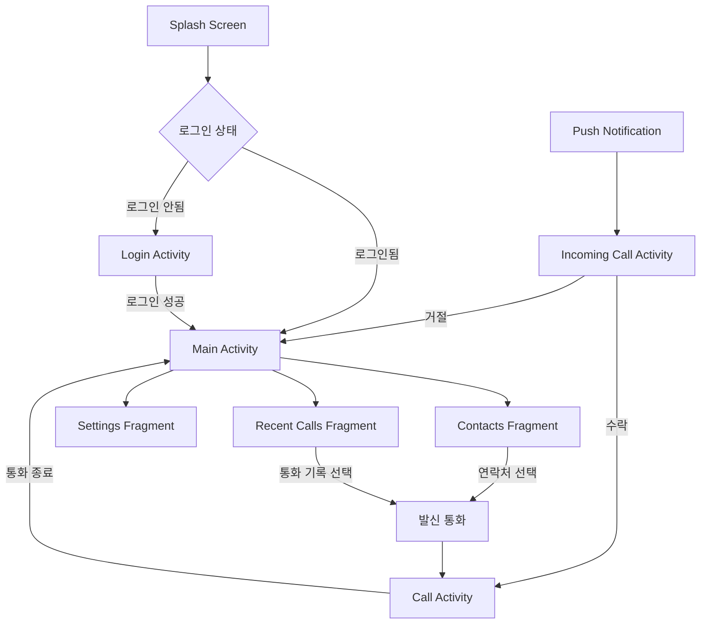

# VOIP Android 클라이언트 기술 명세서

## 목차
1. [개요](#1-개요)
2. [시스템 아키텍처](#2-시스템-아키텍처)
3. [기술 스택](#3-기술-스택)
4. [모듈 구조](#4-모듈-구조)
5. [UI/UX 플로우](#5-uiux-플로우)
6. [WebRTC 구현](#6-webrtc-구현)
7. [데이터 관리](#7-데이터-관리)
8. [보안 구현](#8-보안-구현)
9. [성능 최적화](#9-성능-최적화)

---

## 1. 개요

### 1.1 프로젝트 개요
- **프로젝트명**: VOIP Android 클라이언트
- **목적**: WebRTC 기반 실시간 음성/영상 통화 Android 애플리케이션
- **타겟 플랫폼**: Android 7.0 (API 24) 이상
- **주요 기능**:
  - 1:1 음성/영상 통화
  - 실시간 메시징
  - 연락처 관리
  - 통화 기록
  - 푸시 알림

### 1.2 기술적 요구사항
- **최소 Android 버전**: API 24 (Android 7.0)
- **권장 Android 버전**: API 30 (Android 11) 이상
- **네트워크**: 4G LTE 이상 권장
- **카메라**: 전면/후면 카메라 전환 지원
- **오디오**: 스피커폰/이어피스/블루투스 지원

---

## 2. 시스템 아키텍처

### 2.1 전체 아키텍처

```
┌─────────────────────────────────────────────────────────────┐
│                     Android Application                      │
├─────────────────────────────────────────────────────────────┤
│                    Presentation Layer                        │
│  ┌─────────────┐  ┌──────────────┐  ┌─────────────────┐   │
│  │   Activity   │  │   Fragment   │  │   ViewModel     │   │
│  │  - Login     │  │  - Contacts  │  │  - CallViewModel│   │
│  │  - Main      │  │  - Call      │  │  - UserViewModel│   │
│  │  - Call      │  │  - Settings  │  │  - AuthViewModel│   │
│  └─────────────┘  └──────────────┘  └─────────────────┘   │
├─────────────────────────────────────────────────────────────┤
│                      Domain Layer                            │
│  ┌─────────────┐  ┌──────────────┐  ┌─────────────────┐   │
│  │  Use Cases  │  │  Repository  │  │     Models      │   │
│  │  - MakeCall │  │  - UserRepo  │  │  - User         │   │
│  │  - EndCall  │  │  - CallRepo  │  │  - Call         │   │
│  │  - Login    │  │  - AuthRepo  │  │  - Contact      │   │
│  └─────────────┘  └──────────────┘  └─────────────────┘   │
├─────────────────────────────────────────────────────────────┤
│                       Data Layer                             │
│  ┌─────────────┐  ┌──────────────┐  ┌─────────────────┐   │
│  │   Network   │  │   Database   │  │   Preferences   │   │
│  │  - Retrofit │  │  - Room DB   │  │  - DataStore    │   │
│  │  - Socket.io│  │  - DAO       │  │  - Encrypted    │   │
│  │  - WebRTC   │  │              │  │                 │   │
│  └─────────────┘  └──────────────┘  └─────────────────┘   │
└─────────────────────────────────────────────────────────────┘
```

### 2.2 MVVM 아키텍처 패턴

```kotlin
// View (Activity/Fragment)
    ↓ observes
// ViewModel (LiveData/StateFlow)
    ↓ uses
// Repository (Data coordination)
    ↓ accesses
// Data Sources (Network/Database/Preferences)
```

---

## 3. 기술 스택

### 3.1 개발 환경
- **언어**: Kotlin 1.8+
- **최소 SDK**: 24 (Android 7.0)
- **타겟 SDK**: 33 (Android 13)
- **빌드 도구**: Gradle 7.5+
- **IDE**: Android Studio Flamingo

### 3.2 주요 라이브러리

#### 3.2.1 UI/UX
```gradle
dependencies {
    // Android Core
    implementation 'androidx.core:core-ktx:1.10.1'
    implementation 'androidx.appcompat:appcompat:1.6.1'
    implementation 'com.google.android.material:material:1.9.0'
    
    // Jetpack Compose (선택적)
    implementation 'androidx.compose.ui:ui:1.4.3'
    implementation 'androidx.compose.material3:material3:1.1.1'
    
    // Navigation
    implementation 'androidx.navigation:navigation-fragment-ktx:2.6.0'
    implementation 'androidx.navigation:navigation-ui-ktx:2.6.0'
}
```

#### 3.2.2 네트워킹
```gradle
dependencies {
    // Retrofit
    implementation 'com.squareup.retrofit2:retrofit:2.9.0'
    implementation 'com.squareup.retrofit2:converter-gson:2.9.0'
    
    // OkHttp
    implementation 'com.squareup.okhttp3:okhttp:4.11.0'
    implementation 'com.squareup.okhttp3:logging-interceptor:4.11.0'
    
    // Socket.io
    implementation 'io.socket:socket.io-client:2.1.0'
    
    // WebRTC
    implementation 'org.webrtc:google-webrtc:1.0.32006'
}
```

#### 3.2.3 데이터 관리
```gradle
dependencies {
    // Room Database
    implementation 'androidx.room:room-runtime:2.5.2'
    implementation 'androidx.room:room-ktx:2.5.2'
    kapt 'androidx.room:room-compiler:2.5.2'
    
    // DataStore
    implementation 'androidx.datastore:datastore-preferences:1.0.0'
    
    // Dependency Injection
    implementation 'com.google.dagger:hilt-android:2.47'
    kapt 'com.google.dagger:hilt-compiler:2.47'
}
```

---

## 4. 모듈 구조

### 4.1 프로젝트 구조

```
voipClient/
├── app/
│   ├── src/
│   │   ├── main/
│   │   │   ├── java/com/example/voip/
│   │   │   │   ├── presentation/
│   │   │   │   │   ├── ui/
│   │   │   │   │   │   ├── login/
│   │   │   │   │   │   │   ├── LoginActivity.kt
│   │   │   │   │   │   │   ├── LoginViewModel.kt
│   │   │   │   │   │   │   └── LoginState.kt
│   │   │   │   │   │   ├── call/
│   │   │   │   │   │   │   ├── CallActivity.kt
│   │   │   │   │   │   │   ├── CallViewModel.kt
│   │   │   │   │   │   │   ├── IncomingCallActivity.kt
│   │   │   │   │   │   │   └── CallState.kt
│   │   │   │   │   │   ├── main/
│   │   │   │   │   │   │   ├── MainActivity.kt
│   │   │   │   │   │   │   ├── ContactsFragment.kt
│   │   │   │   │   │   │   ├── RecentCallsFragment.kt
│   │   │   │   │   │   │   └── SettingsFragment.kt
│   │   │   │   │   │   └── common/
│   │   │   │   │   │       ├── BaseActivity.kt
│   │   │   │   │   │       └── BaseViewModel.kt
│   │   │   │   │   └── theme/
│   │   │   │   │       ├── Color.kt
│   │   │   │   │       ├── Theme.kt
│   │   │   │   │       └── Type.kt
│   │   │   │   ├── domain/
│   │   │   │   │   ├── model/
│   │   │   │   │   │   ├── User.kt
│   │   │   │   │   │   ├── Call.kt
│   │   │   │   │   │   └── Contact.kt
│   │   │   │   │   ├── repository/
│   │   │   │   │   │   ├── UserRepository.kt
│   │   │   │   │   │   ├── CallRepository.kt
│   │   │   │   │   │   └── AuthRepository.kt
│   │   │   │   │   └── usecase/
│   │   │   │   │       ├── MakeCallUseCase.kt
│   │   │   │   │       ├── EndCallUseCase.kt
│   │   │   │   │       ├── LoginUseCase.kt
│   │   │   │   │       └── GetContactsUseCase.kt
│   │   │   │   ├── data/
│   │   │   │   │   ├── remote/
│   │   │   │   │   │   ├── api/
│   │   │   │   │   │   │   ├── AuthApi.kt
│   │   │   │   │   │   │   ├── UserApi.kt
│   │   │   │   │   │   │   └── CallApi.kt
│   │   │   │   │   │   ├── dto/
│   │   │   │   │   │   │   ├── UserDto.kt
│   │   │   │   │   │   │   ├── CallDto.kt
│   │   │   │   │   │   │   └── LoginResponse.kt
│   │   │   │   │   │   ├── socket/
│   │   │   │   │   │   │   ├── SocketManager.kt
│   │   │   │   │   │   │   └── SocketEvents.kt
│   │   │   │   │   │   └── webrtc/
│   │   │   │   │   │       ├── WebRTCClient.kt
│   │   │   │   │   │       ├── PeerConnectionObserver.kt
│   │   │   │   │   │       └── RTCDataChannelObserver.kt
│   │   │   │   │   ├── local/
│   │   │   │   │   │   ├── database/
│   │   │   │   │   │   │   ├── AppDatabase.kt
│   │   │   │   │   │   │   ├── UserDao.kt
│   │   │   │   │   │   │   └── CallHistoryDao.kt
│   │   │   │   │   │   ├── entity/
│   │   │   │   │   │   │   ├── UserEntity.kt
│   │   │   │   │   │   │   └── CallHistoryEntity.kt
│   │   │   │   │   │   └── preferences/
│   │   │   │   │   │       ├── PreferencesManager.kt
│   │   │   │   │   │       └── UserPreferences.kt
│   │   │   │   │   └── repository/
│   │   │   │   │       ├── UserRepositoryImpl.kt
│   │   │   │   │       ├── CallRepositoryImpl.kt
│   │   │   │   │       └── AuthRepositoryImpl.kt
│   │   │   │   ├── di/
│   │   │   │   │   ├── AppModule.kt
│   │   │   │   │   ├── NetworkModule.kt
│   │   │   │   │   ├── DatabaseModule.kt
│   │   │   │   │   └── RepositoryModule.kt
│   │   │   │   └── utils/
│   │   │   │       ├── Extensions.kt
│   │   │   │       ├── Constants.kt
│   │   │   │       ├── PermissionUtils.kt
│   │   │   │       └── NetworkUtils.kt
│   │   │   ├── res/
│   │   │   │   ├── layout/
│   │   │   │   ├── values/
│   │   │   │   ├── drawable/
│   │   │   │   └── raw/
│   │   │   └── AndroidManifest.xml
│   │   └── test/
│   └── build.gradle.kts
├── gradle/
├── build.gradle.kts
└── settings.gradle.kts
```

### 4.2 주요 컴포넌트 설명

#### 4.2.1 Presentation Layer
- **Activity**: 화면 전환 및 시스템 이벤트 처리
- **Fragment**: UI 구성 요소
- **ViewModel**: UI 상태 관리 및 비즈니스 로직
- **State**: UI 상태 데이터 클래스

#### 4.2.2 Domain Layer
- **Model**: 비즈니스 도메인 객체
- **Repository Interface**: 데이터 접근 추상화
- **Use Case**: 단일 비즈니스 로직 캡슐화

#### 4.2.3 Data Layer
- **Remote**: 네트워크 통신 (API, Socket, WebRTC)
- **Local**: 로컬 저장소 (Room DB, DataStore)
- **Repository Implementation**: 실제 데이터 접근 구현

---

## 5. UI/UX 플로우

### 5.1 화면 플로우 다이어그램



### 5.2 주요 화면 상세

#### 5.2.1 로그인 화면
```kotlin
// LoginActivity.kt
class LoginActivity : BaseActivity<ActivityLoginBinding>() {
    private val viewModel: LoginViewModel by viewModels()
    
    override fun onCreate(savedInstanceState: Bundle?) {
        super.onCreate(savedInstanceState)
        setupObservers()
        setupClickListeners()
    }
    
    private fun setupObservers() {
        viewModel.loginState.observe(this) { state ->
            when (state) {
                is LoginState.Loading -> showLoading()
                is LoginState.Success -> navigateToMain()
                is LoginState.Error -> showError(state.message)
            }
        }
    }
}
```

#### 5.2.2 통화 화면
```kotlin
// CallActivity.kt
class CallActivity : BaseActivity<ActivityCallBinding>() {
    private val viewModel: CallViewModel by viewModels()
    private lateinit var webRTCClient: WebRTCClient
    
    override fun onCreate(savedInstanceState: Bundle?) {
        super.onCreate(savedInstanceState)
        
        // 권한 확인
        if (!hasRequiredPermissions()) {
            requestPermissions()
            return
        }
        
        initializeWebRTC()
        setupUI()
        observeCallState()
    }
    
    private fun initializeWebRTC() {
        webRTCClient = WebRTCClient(
            context = this,
            eglBase = EglBase.create()
        )
        
        // 로컬 비디오 설정
        binding.localVideoView.init(webRTCClient.eglBase.eglBaseContext, null)
        binding.remoteVideoView.init(webRTCClient.eglBase.eglBaseContext, null)
        
        webRTCClient.initializeLocalStream(binding.localVideoView)
    }
}
```

### 5.3 UI 컴포넌트

#### 5.3.1 통화 제어 버튼
```xml
<!-- call_controls.xml -->
<LinearLayout
    android:layout_width="match_parent"
    android:layout_height="wrap_content"
    android:orientation="horizontal"
    android:gravity="center">
    
    <ImageButton
        android:id="@+id/btnMute"
        android:layout_width="64dp"
        android:layout_height="64dp"
        android:src="@drawable/ic_mic"
        android:background="@drawable/call_button_background"/>
    
    <ImageButton
        android:id="@+id/btnEndCall"
        android:layout_width="64dp"
        android:layout_height="64dp"
        android:src="@drawable/ic_call_end"
        android:background="@drawable/call_end_button_background"
        android:layout_marginHorizontal="32dp"/>
    
    <ImageButton
        android:id="@+id/btnSpeaker"
        android:layout_width="64dp"
        android:layout_height="64dp"
        android:src="@drawable/ic_speaker"
        android:background="@drawable/call_button_background"/>
</LinearLayout>
```

---

## 6. WebRTC 구현

### 6.1 WebRTC 클라이언트

```kotlin
// WebRTCClient.kt
class WebRTCClient(
    private val context: Context,
    private val eglBase: EglBase
) {
    private var peerConnectionFactory: PeerConnectionFactory? = null
    private var peerConnection: PeerConnection? = null
    private var localVideoTrack: VideoTrack? = null
    private var localAudioTrack: AudioTrack? = null
    
    private val iceServers = listOf(
        PeerConnection.IceServer.builder("stun:stun.l.google.com:19302")
            .createIceServer(),
        PeerConnection.IceServer.builder("turn:turn.example.com:3478")
            .setUsername("user")
            .setPassword("password")
            .createIceServer()
    )
    
    init {
        initializePeerConnectionFactory()
    }
    
    private fun initializePeerConnectionFactory() {
        val options = PeerConnectionFactory.InitializationOptions.builder(context)
            .setEnableInternalTracer(true)
            .createInitializationOptions()
        
        PeerConnectionFactory.initialize(options)
        
        val encoderFactory = DefaultVideoEncoderFactory(
            eglBase.eglBaseContext,
            true,
            true
        )
        
        val decoderFactory = DefaultVideoDecoderFactory(eglBase.eglBaseContext)
        
        peerConnectionFactory = PeerConnectionFactory.builder()
            .setVideoEncoderFactory(encoderFactory)
            .setVideoDecoderFactory(decoderFactory)
            .setOptions(PeerConnectionFactory.Options().apply {
                disableEncryption = false
                disableNetworkMonitor = false
            })
            .createPeerConnectionFactory()
    }
    
    fun initializeLocalStream(localVideoView: SurfaceViewRenderer) {
        val videoSource = peerConnectionFactory?.createVideoSource(false)
        val videoCapturer = createCameraCapturer()
        
        videoCapturer?.initialize(
            SurfaceTextureHelper.create("CaptureThread", eglBase.eglBaseContext),
            context,
            videoSource?.capturerObserver
        )
        
        videoCapturer?.startCapture(1280, 720, 30)
        
        localVideoTrack = peerConnectionFactory?.createVideoTrack("video_track", videoSource)
        localVideoTrack?.addSink(localVideoView)
        
        val audioSource = peerConnectionFactory?.createAudioSource(MediaConstraints())
        localAudioTrack = peerConnectionFactory?.createAudioTrack("audio_track", audioSource)
    }
    
    fun createPeerConnection(observer: PeerConnection.Observer): PeerConnection? {
        val rtcConfig = PeerConnection.RTCConfiguration(iceServers).apply {
            bundlePolicy = PeerConnection.BundlePolicy.MAXBUNDLE
            rtcpMuxPolicy = PeerConnection.RtcpMuxPolicy.REQUIRE
            tcpCandidatePolicy = PeerConnection.TcpCandidatePolicy.DISABLED
            continualGatheringPolicy = PeerConnection.ContinualGatheringPolicy.GATHER_CONTINUALLY
            sdpSemantics = PeerConnection.SdpSemantics.UNIFIED_PLAN
        }
        
        return peerConnectionFactory?.createPeerConnection(rtcConfig, observer)
    }
    
    suspend fun createOffer(): SessionDescription? {
        return suspendCoroutine { continuation ->
            val constraints = MediaConstraints().apply {
                mandatory.add(MediaConstraints.KeyValuePair("OfferToReceiveVideo", "true"))
                mandatory.add(MediaConstraints.KeyValuePair("OfferToReceiveAudio", "true"))
            }
            
            peerConnection?.createOffer(object : SdpObserver {
                override fun onCreateSuccess(sessionDescription: SessionDescription) {
                    peerConnection?.setLocalDescription(object : SdpObserver {
                        override fun onCreateSuccess(p0: SessionDescription?) {}
                        override fun onSetSuccess() {
                            continuation.resume(sessionDescription)
                        }
                        override fun onCreateFailure(p0: String?) {}
                        override fun onSetFailure(p0: String?) {}
                    }, sessionDescription)
                }
                
                override fun onSetSuccess() {}
                override fun onCreateFailure(error: String?) {
                    continuation.resumeWithException(Exception(error))
                }
                override fun onSetFailure(error: String?) {}
            }, constraints)
        }
    }
}
```

### 6.2 시그널링 구현

```kotlin
// SignalingClient.kt
class SignalingClient(
    private val baseUrl: String,
    private val authToken: String
) {
    private var socket: Socket? = null
    private val _signalingEvents = MutableSharedFlow<SignalingEvent>()
    val signalingEvents: SharedFlow<SignalingEvent> = _signalingEvents.asSharedFlow()
    
    fun connect() {
        try {
            val options = IO.Options().apply {
                auth = mapOf("token" to authToken)
                transports = arrayOf("websocket")
            }
            
            socket = IO.socket(baseUrl, options).apply {
                on(Socket.EVENT_CONNECT) {
                    Log.d(TAG, "Socket connected")
                    _signalingEvents.tryEmit(SignalingEvent.Connected)
                }
                
                on("incoming-call") { args ->
                    val data = args[0] as JSONObject
                    handleIncomingCall(data)
                }
                
                on("call-accepted") { args ->
                    val data = args[0] as JSONObject
                    handleCallAccepted(data)
                }
                
                on("offer") { args ->
                    val data = args[0] as JSONObject
                    handleOffer(data)
                }
                
                on("answer") { args ->
                    val data = args[0] as JSONObject
                    handleAnswer(data)
                }
                
                on("ice-candidate") { args ->
                    val data = args[0] as JSONObject
                    handleIceCandidate(data)
                }
                
                on("call-ended") { args ->
                    _signalingEvents.tryEmit(SignalingEvent.CallEnded)
                }
                
                on(Socket.EVENT_DISCONNECT) {
                    Log.d(TAG, "Socket disconnected")
                    _signalingEvents.tryEmit(SignalingEvent.Disconnected)
                }
            }
            
            socket?.connect()
        } catch (e: Exception) {
            Log.e(TAG, "Failed to connect socket", e)
        }
    }
    
    fun callUser(targetUserId: String, offer: SessionDescription) {
        val data = JSONObject().apply {
            put("targetUserId", targetUserId)
            put("callType", "video")
            put("offer", JSONObject().apply {
                put("type", offer.type.canonicalForm())
                put("sdp", offer.description)
            })
        }
        
        socket?.emit("call-user", data)
    }
    
    fun acceptCall(roomId: String, answer: SessionDescription) {
        val data = JSONObject().apply {
            put("roomId", roomId)
            put("answer", JSONObject().apply {
                put("type", answer.type.canonicalForm())
                put("sdp", answer.description)
            })
        }
        
        socket?.emit("accept-call", data)
    }
    
    fun sendIceCandidate(targetUserId: String, iceCandidate: IceCandidate, roomId: String) {
        val data = JSONObject().apply {
            put("targetUserId", targetUserId)
            put("roomId", roomId)
            put("candidate", JSONObject().apply {
                put("sdpMLineIndex", iceCandidate.sdpMLineIndex)
                put("sdpMid", iceCandidate.sdpMid)
                put("candidate", iceCandidate.sdp)
            })
        }
        
        socket?.emit("ice-candidate", data)
    }
}

// 시그널링 이벤트
sealed class SignalingEvent {
    object Connected : SignalingEvent()
    object Disconnected : SignalingEvent()
    data class IncomingCall(
        val roomId: String,
        val callerId: String,
        val callerName: String,
        val offer: SessionDescription
    ) : SignalingEvent()
    data class CallAccepted(val roomId: String, val answer: SessionDescription) : SignalingEvent()
    data class RemoteOffer(val userId: String, val offer: SessionDescription) : SignalingEvent()
    data class RemoteAnswer(val userId: String, val answer: SessionDescription) : SignalingEvent()
    data class RemoteIceCandidate(val userId: String, val iceCandidate: IceCandidate) : SignalingEvent()
    object CallEnded : SignalingEvent()
}
```

### 6.3 통화 플로우 구현

```kotlin
// CallViewModel.kt
class CallViewModel @Inject constructor(
    private val callRepository: CallRepository,
    private val webRTCClient: WebRTCClient,
    private val signalingClient: SignalingClient
) : ViewModel() {
    
    private val _callState = MutableStateFlow<CallState>(CallState.Idle)
    val callState: StateFlow<CallState> = _callState.asStateFlow()
    
    private var currentRoomId: String? = null
    private var remoteUserId: String? = null
    
    init {
        collectSignalingEvents()
    }
    
    private fun collectSignalingEvents() {
        viewModelScope.launch {
            signalingClient.signalingEvents.collect { event ->
                when (event) {
                    is SignalingEvent.IncomingCall -> handleIncomingCall(event)
                    is SignalingEvent.CallAccepted -> handleCallAccepted(event)
                    is SignalingEvent.RemoteOffer -> handleRemoteOffer(event)
                    is SignalingEvent.RemoteAnswer -> handleRemoteAnswer(event)
                    is SignalingEvent.RemoteIceCandidate -> handleRemoteIceCandidate(event)
                    is SignalingEvent.CallEnded -> handleCallEnded()
                    else -> {}
                }
            }
        }
    }
    
    fun initiateCall(targetUserId: String) {
        viewModelScope.launch {
            try {
                _callState.value = CallState.Connecting
                remoteUserId = targetUserId
                
                // PeerConnection 생성
                val peerConnection = webRTCClient.createPeerConnection(
                    object : PeerConnectionObserver() {
                        override fun onIceCandidate(iceCandidate: IceCandidate) {
                            currentRoomId?.let { roomId ->
                                signalingClient.sendIceCandidate(
                                    targetUserId,
                                    iceCandidate,
                                    roomId
                                )
                            }
                        }
                        
                        override fun onConnectionChange(newState: PeerConnection.PeerConnectionState) {
                            when (newState) {
                                PeerConnection.PeerConnectionState.CONNECTED -> {
                                    _callState.value = CallState.Connected
                                }
                                PeerConnection.PeerConnectionState.DISCONNECTED,
                                PeerConnection.PeerConnectionState.FAILED -> {
                                    _callState.value = CallState.Disconnected
                                }
                                else -> {}
                            }
                        }
                    }
                )
                
                // 로컬 스트림 추가
                webRTCClient.addLocalStreamToPeerConnection(peerConnection)
                
                // Offer 생성 및 전송
                val offer = webRTCClient.createOffer()
                offer?.let {
                    signalingClient.callUser(targetUserId, it)
                }
                
            } catch (e: Exception) {
                _callState.value = CallState.Error(e.message ?: "Failed to initiate call")
            }
        }
    }
    
    fun acceptCall(roomId: String) {
        viewModelScope.launch {
            try {
                currentRoomId = roomId
                _callState.value = CallState.Connecting
                
                // Answer 생성 및 전송
                val answer = webRTCClient.createAnswer()
                answer?.let {
                    signalingClient.acceptCall(roomId, it)
                }
                
            } catch (e: Exception) {
                _callState.value = CallState.Error(e.message ?: "Failed to accept call")
            }
        }
    }
    
    fun endCall() {
        currentRoomId?.let { roomId ->
            signalingClient.endCall(roomId)
        }
        
        webRTCClient.close()
        _callState.value = CallState.Ended
        
        // 통화 기록 저장
        saveCallHistory()
    }
    
    private fun saveCallHistory() {
        viewModelScope.launch {
            currentRoomId?.let { roomId ->
                callRepository.saveCallHistory(
                    CallHistory(
                        roomId = roomId,
                        remoteUserId = remoteUserId ?: "",
                        startTime = System.currentTimeMillis(),
                        duration = calculateDuration(),
                        callType = "video"
                    )
                )
            }
        }
    }
}

// 통화 상태
sealed class CallState {
    object Idle : CallState()
    object Connecting : CallState()
    object Connected : CallState()
    object Disconnected : CallState()
    object Ended : CallState()
    data class Error(val message: String) : CallState()
}
```

---

## 7. 데이터 관리

### 7.1 로컬 데이터베이스 (Room)

```kotlin
// AppDatabase.kt
@Database(
    entities = [
        UserEntity::class,
        CallHistoryEntity::class,
        ContactEntity::class
    ],
    version = 1,
    exportSchema = true
)
@TypeConverters(Converters::class)
abstract class AppDatabase : RoomDatabase() {
    abstract fun userDao(): UserDao
    abstract fun callHistoryDao(): CallHistoryDao
    abstract fun contactDao(): ContactDao
    
    companion object {
        @Volatile
        private var INSTANCE: AppDatabase? = null
        
        fun getInstance(context: Context): AppDatabase {
            return INSTANCE ?: synchronized(this) {
                val instance = Room.databaseBuilder(
                    context.applicationContext,
                    AppDatabase::class.java,
                    "voip_database"
                )
                .addMigrations(MIGRATION_1_2)
                .build()
                INSTANCE = instance
                instance
            }
        }
    }
}

// CallHistoryEntity.kt
@Entity(tableName = "call_history")
data class CallHistoryEntity(
    @PrimaryKey
    val id: String,
    val remoteUserId: String,
    val remoteUserName: String,
    val remoteUserAvatar: String?,
    val callType: String, // audio, video
    val direction: String, // incoming, outgoing
    val startTime: Long,
    val endTime: Long,
    val duration: Int, // seconds
    val status: String // completed, missed, rejected
)

// CallHistoryDao.kt
@Dao
interface CallHistoryDao {
    @Query("SELECT * FROM call_history ORDER BY startTime DESC")
    fun getAllCallHistory(): Flow<List<CallHistoryEntity>>
    
    @Query("SELECT * FROM call_history WHERE remoteUserId = :userId ORDER BY startTime DESC")
    fun getCallHistoryByUser(userId: String): Flow<List<CallHistoryEntity>>
    
    @Insert(onConflict = OnConflictStrategy.REPLACE)
    suspend fun insertCallHistory(callHistory: CallHistoryEntity)
    
    @Delete
    suspend fun deleteCallHistory(callHistory: CallHistoryEntity)
    
    @Query("DELETE FROM call_history WHERE startTime < :timestamp")
    suspend fun deleteOldCallHistory(timestamp: Long)
}
```

### 7.2 네트워크 통신 (Retrofit)

```kotlin
// NetworkModule.kt
@Module
@InstallIn(SingletonComponent::class)
object NetworkModule {
    
    @Provides
    @Singleton
    fun provideOkHttpClient(
        authInterceptor: AuthInterceptor,
        loggingInterceptor: HttpLoggingInterceptor
    ): OkHttpClient {
        return OkHttpClient.Builder()
            .addInterceptor(authInterceptor)
            .addInterceptor(loggingInterceptor)
            .connectTimeout(30, TimeUnit.SECONDS)
            .readTimeout(30, TimeUnit.SECONDS)
            .writeTimeout(30, TimeUnit.SECONDS)
            .build()
    }
    
    @Provides
    @Singleton
    fun provideRetrofit(okHttpClient: OkHttpClient): Retrofit {
        return Retrofit.Builder()
            .baseUrl(BuildConfig.API_BASE_URL)
            .client(okHttpClient)
            .addConverterFactory(GsonConverterFactory.create())
            .build()
    }
    
    @Provides
    @Singleton
    fun provideAuthApi(retrofit: Retrofit): AuthApi {
        return retrofit.create(AuthApi::class.java)
    }
}

// AuthApi.kt
interface AuthApi {
    @POST("auth/login")
    suspend fun login(
        @Body request: LoginRequest
    ): Response<LoginResponse>
    
    @POST("auth/register")
    suspend fun register(
        @Body request: RegisterRequest
    ): Response<RegisterResponse>
    
    @POST("auth/refresh")
    suspend fun refreshToken(
        @Body request: RefreshTokenRequest
    ): Response<TokenResponse>
    
    @POST("auth/logout")
    suspend fun logout(): Response<Unit>
}

// AuthInterceptor.kt
class AuthInterceptor @Inject constructor(
    private val tokenManager: TokenManager
) : Interceptor {
    
    override fun intercept(chain: Interceptor.Chain): Response {
        val originalRequest = chain.request()
        
        if (originalRequest.url.encodedPath.contains("auth/login") ||
            originalRequest.url.encodedPath.contains("auth/register")) {
            return chain.proceed(originalRequest)
        }
        
        val token = tokenManager.getAccessToken()
        
        if (token.isNullOrEmpty()) {
            return chain.proceed(originalRequest)
        }
        
        val authenticatedRequest = originalRequest.newBuilder()
            .header("Authorization", "Bearer $token")
            .build()
        
        return chain.proceed(authenticatedRequest)
    }
}
```

### 7.3 상태 관리 (DataStore)

```kotlin
// UserPreferencesRepository.kt
class UserPreferencesRepository @Inject constructor(
    @ApplicationContext private val context: Context
) {
    private val Context.dataStore: DataStore<Preferences> by preferencesDataStore(
        name = "user_preferences"
    )
    
    companion object {
        val KEY_USER_ID = stringPreferencesKey("user_id")
        val KEY_USER_NAME = stringPreferencesKey("user_name")
        val KEY_USER_EMAIL = stringPreferencesKey("user_email")
        val KEY_ACCESS_TOKEN = stringPreferencesKey("access_token")
        val KEY_REFRESH_TOKEN = stringPreferencesKey("refresh_token")
        val KEY_IS_LOGGED_IN = booleanPreferencesKey("is_logged_in")
        val KEY_THEME_MODE = stringPreferencesKey("theme_mode")
        val KEY_NOTIFICATION_ENABLED = booleanPreferencesKey("notification_enabled")
    }
    
            val userPreferencesFlow: Flow<UserPreferences> = context.dataStore.data
        .catch { exception ->
            if (exception is IOException) {
                Log.e(TAG, "Error reading preferences", exception)
                emit(emptyPreferences())
            } else {
                throw exception
            }
        }
        .map { preferences ->
            UserPreferences(
                userId = preferences[KEY_USER_ID] ?: "",
                userName = preferences[KEY_USER_NAME] ?: "",
                userEmail = preferences[KEY_USER_EMAIL] ?: "",
                accessToken = preferences[KEY_ACCESS_TOKEN] ?: "",
                refreshToken = preferences[KEY_REFRESH_TOKEN] ?: "",
                isLoggedIn = preferences[KEY_IS_LOGGED_IN] ?: false,
                themeMode = preferences[KEY_THEME_MODE] ?: "system",
                notificationEnabled = preferences[KEY_NOTIFICATION_ENABLED] ?: true
            )
        }
    
    suspend fun saveUserSession(
        userId: String,
        userName: String,
        userEmail: String,
        accessToken: String,
        refreshToken: String
    ) {
        context.dataStore.edit { preferences ->
            preferences[KEY_USER_ID] = userId
            preferences[KEY_USER_NAME] = userName
            preferences[KEY_USER_EMAIL] = userEmail
            preferences[KEY_ACCESS_TOKEN] = accessToken
            preferences[KEY_REFRESH_TOKEN] = refreshToken
            preferences[KEY_IS_LOGGED_IN] = true
        }
    }
    
    suspend fun clearUserSession() {
        context.dataStore.edit { preferences ->
            preferences.remove(KEY_USER_ID)
            preferences.remove(KEY_USER_NAME)
            preferences.remove(KEY_USER_EMAIL)
            preferences.remove(KEY_ACCESS_TOKEN)
            preferences.remove(KEY_REFRESH_TOKEN)
            preferences[KEY_IS_LOGGED_IN] = false
        }
    }
    
    suspend fun updateThemeMode(mode: String) {
        context.dataStore.edit { preferences ->
            preferences[KEY_THEME_MODE] = mode
        }
    }
}

// UserPreferences.kt
data class UserPreferences(
    val userId: String,
    val userName: String,
    val userEmail: String,
    val accessToken: String,
    val refreshToken: String,
    val isLoggedIn: Boolean,
    val themeMode: String,
    val notificationEnabled: Boolean
)